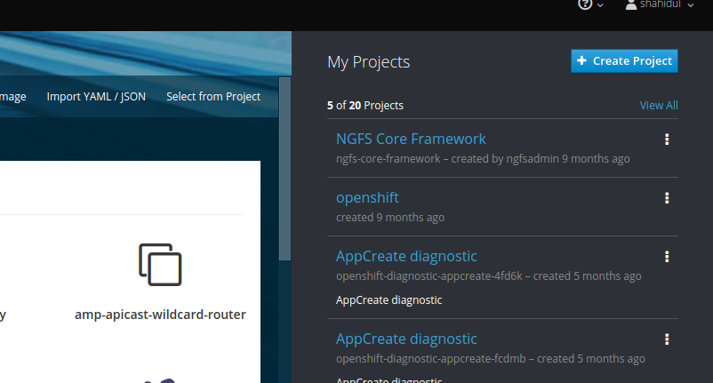

## Prerequisite

Concept of containerization.

## Why Container orchestration is required?

I’m going to ask you 3 questions,

1. How you’re going to deploy your container if it relies on some other
    containers?
2. How you’re going to deal with extra or over growing traffic, if a set
    of microservice/container represents your app?
3. How you’re going to deal with a situation where you need to add extra
    memory and processing power horizontally without disturbing your
    current deployments?


I have an answer for you!
You need to orchestrate your container- you need a mechanism that lets you
deploy related containers at a time, lets you scale them whenever needed.

# Container orchestration is the process of deploying and managing your containers. Docker swarm, kubernetes, mesos are some well known container orchestration technologies.

## What is Openshift?

Openshift is a product of kubernetes(managed kubernetes). It provides a
router, a docker registry, an integrated Jenkins as CI server, a better web console on top of kubernetes.


## How Openshift works?


When a user talk to the api server for a specific job like a pod creation, he actually does this through an API call (golang/python program/ restful call/kubectl/oc). The API server writes that info into the etcd, which is a distributed file system that stores data in key-value pair. Nothing had happened yet. That means no pod has been created yet. kubernetes master has a component named scheduler. This scheduler follows the event (create pod event) and binds this pod to a node. Scheduler actually looks for perfect node for the deployment of this pod. When a scheduler bind a pod to a specific node, the kublet component of that node get informed that it must create a pod inside it’s node. Kublet uses a container runtime to do so. There are many container runtime, like docker,rocket. We can also use our very own runtime engine. Now after creating pod to it’s node, kublet updates pod-states to etcd through API server.

# Openshift uses namespace concept as a grouping mechanism of your pods.


## Let’s deploy a pod

Pod is the smallest unit of kubernetes, so as openshift. It contains a set of images. To deploy a container into a pod we need images of our expected containers. So we have to build image somehow. Openshift supports 2 build strategies-

1. Docker strategy
2. Source to image strategy (s2i).
   
In case of s2i, we need to use a predefined template, where we just need to
enter the repository of our source code. Image will be built according to the
template.
For both the cases we need BuildConfig file which is an openshift object. A
BuildConfig simply contains,
- Repository type, src and secret of repository
- CI server strategy
- Build strategy
- Base image or os
- Output (image name with tag)


# Today we’re going to see, docker build strategy.

Add Docker file with your project like following as kubernetes by default expects a DockerImage, We are dealing with a spring boot project now.


Dockerfile content,

```
FROM openjdk:8-jdk-alpine
EXPOSE 8081
WORKDIR /app
COPY target/ci-cd-pipeline-demo 0.0.1-SNAPSHOT .
ENTRYPOINT [ "java", "-jar", "ci-cd-pipeline-demo 0.0.1-SNAPSHOT.jar" ]
```


Create a namespace or project named ‘cicd-project’ in your openshift cluster.

Click create project,



Create project like following,


Lets create two BuildConfig file for our demo spring boot app. One for addressing repository issues, CI server strategy and another one is for base image and output information. 

BuildConfig 1:

```
kind: "BuildConfig"
apiVersion: "v1"
metadata:
  name: "cicd-pipeline"
spec:
  source:
    git:
      ref: master
      uri: 'https://github.com/LEADSNGFS/ci-cd-pipeline-demo.git'
    sourceSecret:
      name: github-secret
    type: Git
  strategy:
    jenkinsPipelineStrategy:
      jenkinsfilePath: jenkins/jenkinsFile
    type: JenkinsPipeline
```
Here ```spec.source.git.ref``` holds commit id or branch name, ```spec.source.git.uri``` holds source code url and as we're using jenkins pipeline strategy, ```spec.strategy.jenkinsPipelineStrategy.jenkinsfilePath``` holds path of jenkins file.

Add jenkinFile inside a folder named jenkins with the src like following,

JenkinsFile:

```
pipeline{
  agent { label 'maven' }
  stages{
    stage ('checkout'){
      steps{
        checkout scm
      }
  }
    stage ('build') {
      steps{
      sh "mvn clean package -DskipTests"       
      }
    }
    stage ('build image') {
      steps{
      sh '''
          oc start-build cicd-build --from-dir=. --follow
        '''
      }
    }    
    
  }
}

```
In the step of ```build image``` stage an openshift build config named ```cicd-build``` is triggered. Let's create another build config for this.

BuildConfig 2:

```
apiVersion: build.openshift.io/v1
kind: BuildConfig
metadata:
  labels:
    build: cicd-build
  name: cicd-build
  namespace: cicd-project
spec:
  failedBuildsHistoryLimit: 5
  nodeSelector: null
  output:
    to:
      kind: ImageStreamTag
      name: 'cicd:latest'
  postCommit: {}
  resources: {}
  runPolicy: Serial
  source:
    type: Binary
  strategy:
    dockerStrategy:
      from:
        kind: ImageStreamTag
        name: 'openjdk:8-jdk-alpine'
    type: Docker
```

- ## The smallest unit of kubernetes or openshift is pod. A pod just contains the information of the images that it will contain and env variables.

- ## A Replication controller, contains information of a pod with how many replicas of that pod are expected. 

- ## A DeploymentConfig is the largest resource of kubernetes or openshift. It contains Replication controller with pods rollback policy, provisioning details, claim or volumn mounting details others application lifecycle details.

## So DeploymentConfig object extends Replication controller, Replication controller extends Pod.


Let’s create a DeploymentConfig file,

```
apiVersion: apps.openshift.io/v1
kind: DeploymentConfig
metadata:
  labels:
    app: cicd
  name: cicd
  namespace: cicd-project
spec:
  replicas: 1
  selector:
    app: cicd
    deploymentconfig: cicd
  strategy:
    activeDeadlineSeconds: 21600
    resources: {}
    rollingParams:
    type: Recreate
  template:
    metadata:
      labels:
        app: cicd
        deploymentconfig: cicd
    spec:
      containers:
        - image: docker-registry.default.svc:5000/cicd-project/cicd
          imagePullPolicy: Always
          name: cicd
          ports:
            - containerPort: 8081
              protocol: TCP
      dnsPolicy: ClusterFirst
      restartPolicy: Always
      schedulerName: default-scheduler
      securityContext: {}
      terminationGracePeriodSeconds: 30
  triggers:
    - type: ConfigChange
    - imageChangeParams:
        automatic: true
        containerNames:
          - cicd
        from:
          kind: ImageStreamTag
          name: 'cicd:latest'
          namespace: cicd-project
      type: ImageChange

```

A ImageStream is a resource that is used to perform automatic deployment, if corresponding image gets updated.

Let’s create an imagestream for a build,

```
apiVersion: image.openshift.io/v1
kind: ImageStream
metadata:
  labels:
    build: cicd-build
  name: cicd-build
  namespace: cicd-project
```

Let's talk about another two important object, ````service``` and ```route```.


Route exposes the service of a specific pod. 
Pods are ephemeral. Nodes can go down any time. Suppose, we got 3 nodes (worker) on our cluster. We have a deployment ‘CRM’ with a replication factor 3. These 3 replicas of pod have been instantiated inside 3 different nodes. Suddenly, one node got down. Node controller will update the state of the node and its pods to etcd through API server. Now in this case, replication controller will be informed that there must be 3 replicas of pod- ‘CRM’ running, but etcd saying, currently 2 of them are running. Replication Controller will inform scheduler. Scheduler will search for proper node to create instance of pod ‘CRM’. After creating pod instance, it will update pod state to etcd via API server again. 
When a user sends a request to a pod, service decides where to send the request as there can be multiple replica of that pod running. If a replica of a pod get destroyed and another replica get instantiated, service can use them or register them with labels. 


Lets create a service, we're using cluster ip.

```
apiVersion: v1
kind: Service
metadata:
  labels:
    app: cicd
  name: cicd
  namespace: cicd-project
spec:
  ports:
    - name: 8080-tcp
      port: 8080
      protocol: TCP
      targetPort: 8081
  selector:
    deploymentconfig: cicd
  type: ClusterIP

```

Let’s create a route,

```
apiVersion: route.openshift.io/v1
kind: Route
metadata:
  labels:
    app: cicd
  name: cicd
  namespace: cicd-project
spec:
  host: cicd-cicd-project.apps.115.127.24.184.nip.io
  port:
    targetPort: 8080-tcp
  to:
    kind: Service
    name: cicd
    weight: 100
  wildcardPolicy: None
```

Copyright ​©[Shahidul islam](https://www.linkedin.com/in/shahidul-islams-profile)